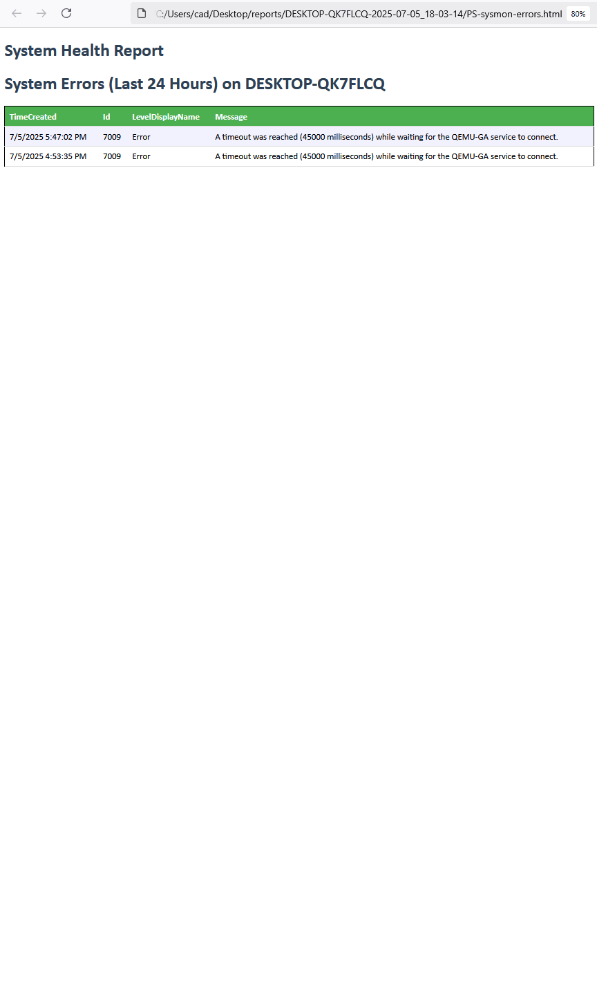

# WinHealthReportHTML

A PowerShell script that generates a detailed, user-friendly HTML report on the health and status of a Windows system. It's designed for system administrators to get a quick, glanceable, and actionable overview, perfect for scheduled health checks or initial troubleshooting.

<div align="center">
  <table>
    <tr style="vertical-align: top;">
      <td></td>
      <td></td>
    </tr>
  </table>
</div>

## Description

`WinHealthReportHTML.ps1`, gathers critical system metrics and presents them in a clean, color-coded HTML dashboard. Instead of manually checking Event Viewer, services, and performance counters, you can run this script to generate a complete system health snapshot.

A key feature is the linked error report. If system errors are found, the main report provides a clickable link to a separate HTML page containing the full details of each error, keeping the main dashboard tidy while providing deep-dive information when needed.

## Features

-   **General System Information**: Reports the hostname, OS version, architecture, and system uptime.
-   **Event Viewer Summary**: Counts critical errors and warnings from the System log in the last 24 hours.
-   **Clickable Error Details**: Generates a separate, linked HTML file with full details of each system error found.
-   **Disk Usage**: Lists all fixed disks with total size, free space, and a color-coded usage percentage.
    -   `Warning` state for disks over 90% full.
    -   `CRITICAL` state for disks over 95% full.
-   **CPU & Memory Utilization**: Shows current CPU load and memory usage with color-coding for high utilization.
-   **Hardware Temperature**: Reports CPU/System temperatures by querying WMI. Gracefully handles systems where sensors are not available.
-   **Top 5 Processes**: Lists the top 5 processes currently consuming the most CPU and memory.
-   **Monitored Services Status**: Checks a customizable list of critical services and reports their status (`Running`, `Stopped`, or `NOT FOUND`).
-   **Clean HTML Output**: Generates a well-formatted and styled HTML report that is easy to read.

## Prerequisites

1.  **PowerShell**: PowerShell 5.1 or higher. (This is standard on Windows 10/11 and Windows Server 2016/2019/2022).
2.  **Execution Policy**: The PowerShell execution policy on your system must allow scripts to run. If you downloaded this script from the internet, you may need to "unblock" it first by running this command:
    ```powershell
    Unblock-File -Path ".\WinHealthReportHTML.ps1"
    ```
    If scripts are still blocked, you may need to set the execution policy for your user account:
    ```powershell
    Set-ExecutionPolicy -Scope CurrentUser -ExecutionPolicy RemoteSigned
    ```
3.  **Administrator Privileges**: The script needs to be **run as an Administrator** to access all system information, especially from WMI/CIM and the Event Log.

## Usage

1.  Open PowerShell **as an Administrator**.
2.  Navigate to the directory where you saved the script:
    ```powershell
    cd C:\Scripts
    ```
3.  Execute the script:
    ```powershell
    .\WinHealthReportHTML.ps1
    ```
4.  Once completed, the script will output two files in the `C:\temp` folder (or the folder you configured):
    -   `WinHealthReport.html`: The main health report dashboard.
    -   `WinHealthReport_Errors.html`: The detailed error log (only created if errors are found).

Open `WinHealthReport.html` in any web browser to view the results.

## Customization

You can easily customize the script by editing the variables in the **`--- Configuration ---`** section at the top of the file.

-   **Output Folder**: Change the location where reports are saved.
    ```powershell
    $outputFolder = "C:\Reports\SystemHealth"
    ```
-   **Monitored Services**: Add or remove services from the check list. Use the service's "short name" (not the display name).
    ```powershell
    # Example for a server running SQL and IIS
    $servicesToCheck = @(
        "spooler",
        "WinRM",
        "MSSQLSERVER",
        "W3SVC"
    )
    ```
-   **Alert Thresholds**: Adjust the percentages at which the report uses warning (`yellow`) or critical (`red`) colors.
    ```powershell
    $diskCriticalThreshold = 95 # Percentage
    $cpuWarningThreshold = 90   # Percentage
    ```

## License

This project is licensed under the MIT License. See the [LICENSE](LICENSE) file for details.